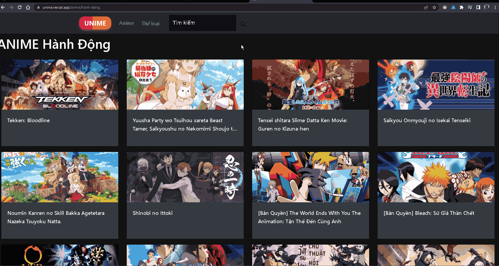

<h1>UNIME</h1>

UNIME (previously named MIRAI) is an anime website that provides you with anime completely free without ads.

The site: [UNIME](https://unime.vercel.app/)

<h2>Motivation</h2>
Before I learned HTML/CSS/Javascript to become a web developer, I'd always dreamt of creating an anime page for myself to watch without ads, which drove me to learn the necessary technology and tools required for this first "from scratch" project.

## Table of contents
- [TECHNOLOGIES](#technologies)
- [SHOWCASE](#showcase)
- [WHAT NEED TO IMPROVE](#improve)
- [SOURCES](#sources)
- [INSTALLATION](#installation)

## Technologies
- ReactJS
- HTML
- CSS
- Javascript
- Bootstrap
- Heroku
- Vercel
- React Router DOM
- Swiper
- AXIOS
- MUI
- React Icons
- etc.

## Showcase

<h3>HOME PAGE</h3>

<h3>Anime/Category Page with Infinite Load</h3>

<h3>Search Page</h3>

<h3>Info Page with Youtube, Anilist, and anime Data</h3>

<h3>Watch page</h3>

Everything is responsive, shrink down the web page or using it on device for further more detail.

## Improve
- A better way for writing these kinds of projects in the future.
- Write a better CSS, since it's my first-hand project, I did mess up the global CSS which lead me to override a lot of CSS.
- Apply more ways and technologies needed (like Redux, useMemo, useRef, etc. for more flexibility in handling data)
- Fix bugs if it's still around, but I'm trying on other projects, so progress on this will be plodding.

# SOURCES
- This is a free project, the data is from [Vuighe](https://vuighe.net/), please support them.
- Combine with [Anilist](https://anilist.co/) data and [Youtube](https://www.youtube.com/) for trailer provider and further information for anime.

# Installation
- Simply use `git clone https://github.com/huy232/mirai.git` to clone my project to your local.
- Use `git i` to install all needed dependencies in this project.
- Use `npm start` to run the project.
- Feel free to modify, fork and make it better.

This page will only work until 28 November, since it's the day Heroku shut down Free Plan, which will affect my Back-end, that's the data that I'm using for MIRAI/UNIME. If it's still working, then it's due to the migration that I'm trying and it has succeeded.

Feel free to contact or bug report to me, if you see any better solutions, more optimized ways of coding, or just want to share it with me, I'll gladly and kindly listen to it, have a nice day!